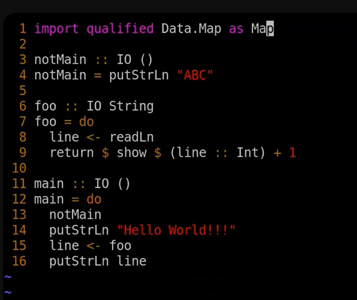

:t    podaje typ wyrażenia, a nie wartość
:: -> dla wyrazenia typu
:  -> cons na liście

42 :: Int -> anotacja typowa
42 :: Int -> maszynowy
42 :: Integer - to jest taki BigNum

Typ option
:t Nothing
:: Maybe a
:t Just
Konstruktory nie muszą byc w pełnie nakarmione

:t underfined -> jest dowolnego typu, w szczególności może być typu pustego

Void - typ pusty

Typy dla typów się nazywają rozdzajami
:k Either
:k Maybe
:k ()

:t map
map (\ x -> x+1) [1,2,3]
map (+ 1 ) [1,2,3] -> biorę operator binarny, jako jego drugo argument przekazuje 1
map (1 +) [1,2,3] -> pierwszy argument to jest 1

ghci> :t (==)
(==) :: Eq a => a -> a -> Bool

Dla wszystkich typów Eq, które da się porównywać

ghci> :t all
all :: Foldable t => (a -> Bool) -> t a -> Bool
Troszkę bardziej polimorficznie niż w ocamlu

ghci> all (\x -> x `mod` 2 == 0) [2,2,4]
True

`mod` będzie znaczyć, że można tą funkcję użyć infiksowo

Mamy foldl foldr
ghci> :t foldl
foldl :: Foldable t => (b -> a -> b) -> b -> t a -> b

***Typ Maybe jest Foldable***
ghci> all (const False) Nothing
True

:t const

Haskel jest liniwym językiem, więc jedyny sposób wymuszenia obliczenia to używanie patter matchingu,
ale na funkcjach nie ma jak tego zrobić, więc const pomaga na odróźnić ?? 

***Jeszcze jedna z prostszych rzeczy***
[1..5]
[1..] - > wszystkie liczby naturalne

take 42 $ drop 13 [1..]
dolar nie róbi nić dobrego bo wiąze prawo i słabiej niż aplikacji funkcji
 
- Każda lista w Hackelu jest liniwa
- Leniwość tutaj to jest leniowość ze spamiętywaniem
- Kolejność obliczeń jest non-strict
- Nie wolno liczyć czegość, czego nie będzie potrzebować, ale nie jest wyspecyfikowane w jakiej kolejności
- Uzywa call by name ... 
- Bo nie ma skutków ubocznych

-- :t map (\x -> printStrLn $ show x) [1,2,3]
-- -- język czysty potrafi opisać obliczenia z efektami ubocznymi, ale nie potrafi robić efekty uboczne

-- ghci> :t putStrLn
-- putStrLn :: String -> IO ()
-- getLine >>= putStrLn -- echo
-- ghci> getLine >>= (\x -> putStrLn $ x ++ x) -- konkatenacja

